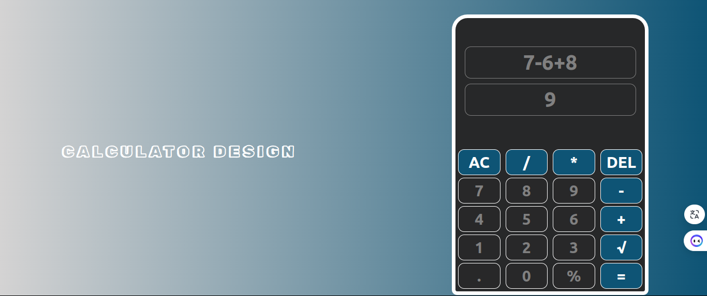
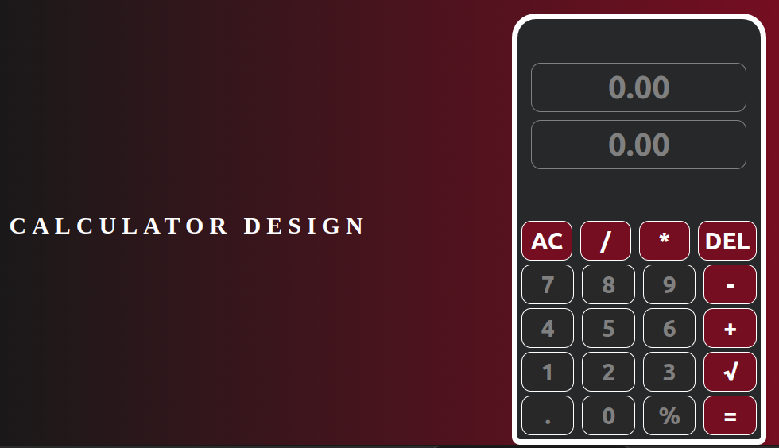

# Calculator Website

This is a simple calculator website where users can perform basic arithmetic operations.

## Features

- Addition: Add two numbers together.
- Subtraction: Subtract one number from another.
- Multiplication: Multiply two numbers.
- Division: Divide one number by another
- modulo : return the remaining number

Usage

Enter the first number in the input field.
Select the desired operation (addition, subtraction, multiplication, or division).
Enter the second number in the input field.
Click the "Calculate" button to perform the operation.
The result will be displayed.

Contributing
Contributions are welcome! If you find any issues or want to add new features, please open an issue or submit a pull request.

Acknowledgments
Bootstrap - CSS framework used for styling.
Font Awesome - Icon library used for icons.

If you have any questions or suggestions, feel free to contact me at  bakerboonsa@gmail.com